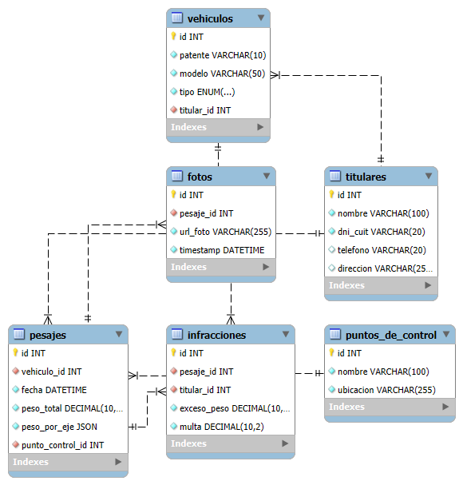

# Proyecto Final: Gestión de Control de Pesaje de Camiones

## Introducción
En este proyecto se desarrollará una base de datos destinada a la gestión de control de pesaje de camiones. La base de datos permitirá llevar un control detallado de los camiones, pesajes, dueños de los vehículos (titulares), puntos de control, infracciones, reincidencias y fotos.

## Objetivo
El objetivo principal del proyecto es implementar una solución de base de datos que optimice la gestión de control de pesaje de camiones, facilitando el acceso a la información y mejorando la eficiencia operativa. La base de datos cubrirá aspectos logísticos y de cumplimiento de normativas, permitiendo un seguimiento preciso de los pesajes y sanciones.

## Situación Problemática
La empresa enfrenta dificultades para mantener un control eficiente del pesaje de camiones, lo que resulta en sanciones por exceso de peso, demoras en la entrega de productos y una gestión ineficaz de los dueños de los vehículos y rutas. La implementación de una base de datos permitirá solucionar estas brechas, proporcionando una fuente única y centralizada de información actualizada.

## Modelo de Negocio
La organización es una empresa de transporte que necesita gestionar eficientemente el pesaje de sus camiones y rutas. El modelo de negocio incluye la asignación de rutas a los camiones, el control del peso de los camiones en diferentes puntos de control y la gestión de sanciones por exceso de peso. La base de datos facilitará la gestión de estas operaciones, permitiendo un acceso rápido a la información y mejorando la toma de decisiones.

## Diagramas de Entidad-Relación
A continuación se presenta el diagrama E-R que representa la estructura de la base de datos, incluyendo las entidades y sus relaciones:



## # Listado de Tablas

### Tabla: Titulares
- Descripción: Almacena información sobre los titulares de los vehículos.
- Campos:
  - id (INT, PRIMARY KEY, AUTO_INCREMENT): Identificador único del titular.
  - nombre (VARCHAR(255), NOT NULL): Nombre del titular.
  - direccion (VARCHAR(255)): Dirección del titular.
  - telefono (VARCHAR(50)): Teléfono de contacto del titular.
  - email (VARCHAR(100)): Email del titular.

### Tabla: Puntos de Control
- Descripción: Almacena información sobre los puntos de control de pesaje.
- Campos:
  - id (INT, PRIMARY KEY, AUTO_INCREMENT): Identificador único del punto de control.
  - nombre (VARCHAR(255), NOT NULL): Nombre del punto de control.
  - ubicacion (VARCHAR(255), NOT NULL): Ubicación del punto de control.

### Tabla: Vehículos
- Descripción: Almacena información sobre los vehículos.
- Campos:
  - id (INT, PRIMARY KEY, AUTO_INCREMENT): Identificador único del vehículo.
  - patente (VARCHAR(50), NOT NULL): Patente del vehículo.
  - modelo (VARCHAR(50), NOT NULL): Modelo del vehículo.
  - tipo (VARCHAR(50), NOT NULL): Tipo de vehículo.
  - titular_id (INT, NOT NULL, FOREIGN KEY): Identificador del titular del vehículo.

### Tabla: Pesajes
- Descripción: Almacena información sobre los pesajes de los vehículos.
- Campos:
  - id (INT, PRIMARY KEY, AUTO_INCREMENT): Identificador único del pesaje.
  - vehiculo_id (INT, NOT NULL, FOREIGN KEY): Identificador del vehículo.
  - punto_control_id (INT, NOT NULL, FOREIGN KEY): Identificador del punto de control.
  - fecha (DATETIME, NOT NULL): Fecha del pesaje.
  - peso_total (DECIMAL(10,2), NOT NULL): Peso total del vehículo en toneladas.
  - peso_por_eje (JSON, NOT NULL): Peso por eje del vehículo en formato JSON.

### Ejemplo de Formato JSON para "peso_por_eje"
```json
{
    "ejes": [
        {"nro_eje": 1, "peso": 3771},
        {"nro_eje": 2, "peso": 3585},
        {"nro_eje": 3, "peso": 3755},
        {"nro_eje": 4, "peso": 3791}
    ]
}
```

### Tabla: Fotos
- Descripción: Almacena información sobre las fotos tomadas durante los pesajes.
- Campos:
  - id (INT, PRIMARY KEY, AUTO_INCREMENT): Identificador único de la foto.
  - pesaje_id (INT, NOT NULL, FOREIGN KEY): Identificador del pesaje.
  - url_foto (VARCHAR(255), NOT NULL): URL de la foto.
  - timestamp (DATETIME, NOT NULL): Timestamp de la foto.

### Tabla: Infracciones
- Descripción: Almacena información sobre las infracciones detectadas durante los pesajes.
- Campos:
  - id (INT, PRIMARY KEY, AUTO_INCREMENT): Identificador único de la infracción.
  - pesaje_id (INT, NOT NULL, FOREIGN KEY): Identificador del pesaje.
  - tipo_infraccion (VARCHAR(255), NOT NULL): Tipo de infracción.
  - descripcion (TEXT, NOT NULL): Descripción de la infracción.

## Archivo .sql
El script de creación de la base de datos y tablas está disponible en el siguiente repositorio de GitHub:

[Repositorio SQL](https://github.com/facundoalmiento/controldepesaje-Almiento.git)
